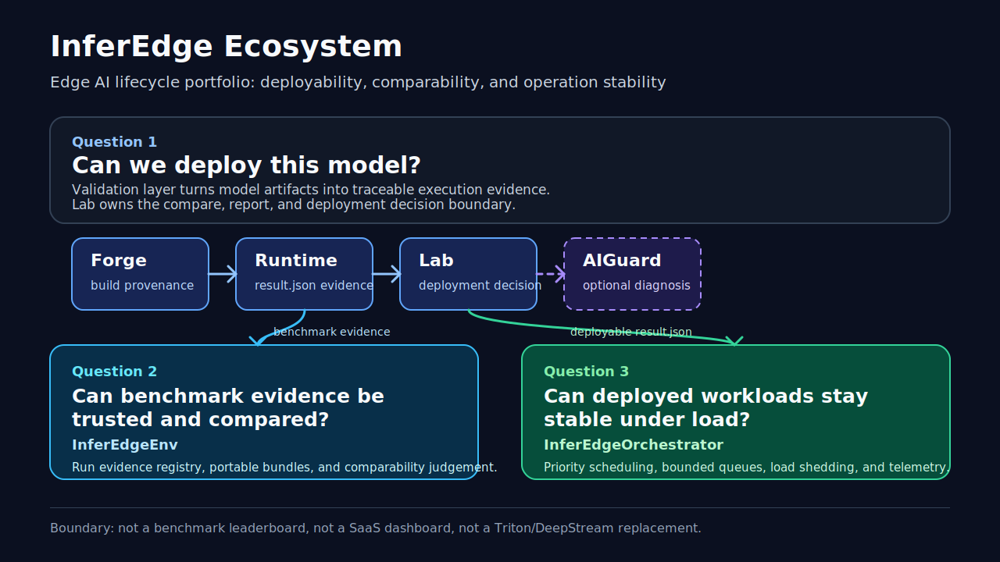

# InferEdge

Language: English | [한국어](README.ko.md)

InferEdge is a local-first Edge AI inference validation portfolio. It connects
build provenance, real runtime evidence, validation reports, optional
deterministic diagnosis, and Lab-owned deployment decisions across separate
repositories without turning the project into a production SaaS dashboard,
cloud control plane, or generic monitoring stack.

The short version:

| Signal | Evidence |
|---|---|
| Deployability pipeline | Forge -> Runtime -> Lab -> optional AIGuard |
| Comparability layer | EdgeEnv local registry / comparability / runtime regression evidence |
| Operation layer | Orchestrator queue/deadline/fallback and worker-health evidence |
| Jetson TensorRT result | YOLOv8n TensorRT FP16: 10.066 ms mean, 15.548 ms p99, 99.34 FPS |
| CPU baseline | ONNX Runtime CPU: 45.430 ms mean, 49.213 ms p99, 22.01 FPS |
| Real device replay | Jetson Orin Nano ONNX replay: 155.86 ms mean, 156.877 ms p95, 45.5 C, 1000 MB RAM |
| Sustained operation smoke | 5-minute-class Jetson replay: 3600 frames, 152.77 ms mean, 156.948 ms p95, 50.375 C, 1038 MB RAM |

## Quick Start

Clone the entrypoint and pinned smoke repositories:

```bash
git clone https://github.com/gwonxhj/InferEdge.git
cd InferEdge
bash scripts/clone_all.sh --locked
```

Run the local portfolio smoke:

```bash
bash scripts/smoke_all.sh
```

That smoke checks Forge, Runtime, Lab, AIGuard, Orchestrator, Env, and the
local-first Runtime Intelligence artifact chain. It validates reviewer-facing
report markers and contract boundaries. Boundary marker: Production observability platform or GitLab control plane is out of scope.

Reviewer verification set:

```bash
python -m pytest -q
git diff --check
bash scripts/smoke_all.sh
bash scripts/check_publish_ready.sh
```

This is the entrypoint verification set referenced by the reviewer completion
audit. Run `scripts/smoke_all.sh` after `scripts/clone_all.sh --locked` or with
`INFEREDGE_REPOS_DIR` pointing at the sibling InferEdge repositories. Jetson
hardware is not required for this verification set; fresh sustained Jetson
capture remains a separate later evidence task.

For safe review-branch publishing, run:

```bash
bash scripts/check_publish_ready.sh
```

See [Publish InferEdge Entrypoint](docs/publish_inferedge.md) for the
non-fast-forward and unrelated-history blocked states, the bundled branch
publish + PR creation + PR merge step, PR changed-file/status gate, PR
`Summary` / `Tests` recording, final status check, local checkout safety,
stale-main apparent untracked-file recovery, optional branch cleanup, and
diagnostic escape-hatch flags.
Do not force push over the existing public `main` history.

## Architecture

InferEdge separates three questions that are often mixed together in inference
projects:

```text
Can we deploy this model?                         -> InferEdge validation layer
Can this benchmark evidence be trusted and compared? -> InferEdgeEnv comparability layer
Can deployed workloads stay stable under load?   -> InferEdgeOrchestrator operation layer
```



```text
ONNX Model
-> InferEdgeForge
-> InferEdge-Runtime
-> InferEdgeLab
-> optional InferEdgeAIGuard
-> Deployment Decision Report
-> Local Studio
```

Runtime Operation / Intelligence evidence extends the pipeline without
replacing it:

```text
InferEdgeOrchestrator operation context
-> InferEdgeEnv registry / comparability / regression evidence
-> optional InferEdgeAIGuard deterministic evidence
-> InferEdgeLab Runtime Intelligence Risk Summary
-> Lab-owned deployment decision
```

## Repositories

| Repository | Role | URL |
|---|---|---|
| InferEdgeForge | Build provenance, metadata, manifest, artifact handoff | https://github.com/gwonxhj/InferEdgeForge |
| InferEdge-Runtime | C++ execution, Lab-compatible `result.json`, Jetson/runtime result evidence | https://github.com/gwonxhj/InferEdge-Runtime |
| InferEdgeLab | Compare/evaluate/report/API/Local Studio/deployment decision owner | https://github.com/gwonxhj/InferEdgeLab |
| InferEdgeAIGuard | Optional deterministic diagnosis evidence provider | https://github.com/gwonxhj/InferEdgeAIGuard |
| InferEdgeEnv | Local evidence registry, comparability checker, runtime regression owner | https://github.com/gwonxhj/InferEdgeEnv |
| InferEdgeOrchestrator | Runtime operation context provider for queue/deadline/fallback evidence | https://github.com/gwonxhj/InferEdgeOrchestrator |

## Evidence Snapshot

| Evidence | Current record | Where to inspect |
|---|---|---|
| TensorRT Jetson FP16 | mean 10.066401 ms, p99 15.548438 ms, 99.340373 FPS | Local Studio demo evidence |
| ONNX Runtime CPU baseline | mean 45.4299 ms, p99 49.2128 ms, 22.0119 FPS | Local Studio demo evidence |
| TensorRT speedup | about 4.51x FPS over ONNX Runtime CPU | Local Studio demo evidence |
| YOLOv8 subset validation | 10 images, 89 boxes, simplified mAP@50 0.1410, precision 0.2941, recall 0.1685 | Lab evaluation evidence |
| Jetson device-local replay | 96 frames, 155.86 ms mean, 156.877 ms p95, max 45.5 C / 1000 MB RAM | [`Jetson Device-Local Agent Runtime Evidence Report`](docs/evidence/jetson_device_local_agent_runtime_report.md) ([한국어: Jetson 디바이스 로컬 에이전트 런타임 증거 보고서](docs/evidence/jetson_device_local_agent_runtime_report.ko.md)) |
| Jetson 5-minute-class sustained replay | 3600 frames, Vision mean 152.77 ms, p95 156.948 ms, max 50.375 C / 1038 MB RAM | [`Jetson Device-Local 5-Minute Sustained Smoke Report`](docs/evidence/jetson_device_local_5min_sustained_report.md) ([한국어: Jetson 디바이스 로컬 5분급 지속 스모크 보고서](docs/evidence/jetson_device_local_5min_sustained_report.ko.md)), [`Snapshot HTML report`](docs/evidence/jetson_device_local_5min_sustained_report.html) ([한국어: 대표 스냅샷 HTML 보고서](docs/evidence/jetson_device_local_5min_sustained_report.html)) |
| Jetson operation-summary quick-scan registry | Latest `c04abc9` 96-frame and 5-minute rows with linked metric snapshots (`155.86` / `156.877` ms, `45.5 C` / `1000 MB`; `152.77` / `156.948` ms, `50.375 C` / `1038 MB`), `Duration Comparison Summary`, `Operation Quick Scan Summary`, `operation_summary` labels, and Lab preservation context | [`Latest Jetson Quick-Scan Registry`](docs/agent_runtime_e2e_demo.md#latest-jetson-quick-scan-registry) ([한국어: 최근 Jetson quick-scan marker 재현](docs/agent_runtime_e2e_demo.ko.md#최근-jetson-quick-scan-marker-재현)) |

The Jetson records prove local evidence preservation and runtime-operation
handoff. They do not claim decoded YOLO accuracy, live camera service,
Whisper/FastAPI service execution, production remote execution, or thermal
endurance validation.

## Implementation Snapshot

| Area | Status | Reviewer signal |
|---|---|---|
| Core Forge -> Runtime -> Lab -> optional AIGuard validation pipeline | Implemented | Build provenance, Runtime result evidence, Lab compare/report/decision, optional deterministic AIGuard evidence |
| Local Studio demo evidence replay | Implemented | Local browser workflow for demo evidence, compare, deployment decision, and AIGuard cases |
| YOLOv8 COCO subset / model contract validation | Implemented | Subset evaluation plus bbox/score/contract validation |
| AIGuard diagnosis cases | Implemented | Deterministic bbox, score, baseline, temporal, and runtime-reliability warning evidence |
| Runtime Intelligence artifact gate | Implemented | Cross-repo smoke for the `Orchestrator -> EdgeEnv -> AIGuard -> Lab` bundle, including directly gated policy-pressure alignment, Jetson preservation, and remote fallback Lab markers |
| Orchestrator producer-backed / device-local smoke | Smoke/Starter | Queue depth, drop/fallback, policy reason, Lab operation context, and EdgeEnv preservation evidence |
| Remote dispatch / fallback starter | Smoke/Starter | File-based worker selection, local HTTP fallback worker evidence, bounded fallback recovery, Lab-owned report context |
| Cloudflare / dashboard / production worker services | Future Work | Documented direction only |

## Runtime Intelligence Smoke

The Runtime Intelligence artifact gate is a Cross-repo smoke that keeps the
`Orchestrator -> EdgeEnv -> AIGuard -> Lab` artifact chain readable and
reproducible. The Lab's local-first Runtime Intelligence artifact preserves
remote-dispatch boundary rows, Runtime replay duration scope, and compact
queue/deadline/fallback operation markers without making CI a runtime control
plane.
The current handoff gate also checks that policy-pressure summary run IDs stay
aligned between EdgeEnv handoff context and AIGuard `guard_analysis` raw context
before Lab consumes the artifact.

Curated reviewer sample handoff:

- `examples/telemetry/agent_scheduler_delay_sample.json` stays an Orchestrator
  sample input for the `scheduler_delay_pattern` AIGuard evidence path.
- `examples/telemetry/remote_fallback_recovery_sample.json` stays an
  Orchestrator sample input for the `remote_execution_recovered_by_fallback`
  AIGuard evidence path.

These sample paths are reviewer anchors for the
`Orchestrator -> EdgeEnv -> AIGuard -> Lab` handoff. They are not Forge
artifacts, Runtime benchmark outputs, Lab decision-policy inputs, or completed
production remote execution.

Reviewer path:

| Step | What to inspect | Why it matters |
|---|---|---|
| 1 | `runtime_intelligence_bundle_manifest_gate_summary.md` | Confirms the `Orchestrator -> EdgeEnv -> AIGuard -> Lab` bundle, owner boundary, and policy-pressure handoff alignment are intact. |
| 2 | EdgeEnv `examples/regression/fixture_matrix.json` | Confirms same-condition, runtime-comparison, target-comparison, protocol-mismatch, telemetry-gap, and replay-sequence fixtures are covered before Lab consumes the evidence. |
| 3 | `runtime_anomaly_summary.md` / `.html` | Shows the Lab-owned Runtime Intelligence Risk Summary, duration traceability, and operation quick scan in one report. |
| 4 | Lab `Review Path` section and `Validated Review Path` gate summary | Keeps the README -> Lab report -> gate summary reading order explicit for reviewers without making CI, AIGuard, or Orchestrator the report owner. Detailed marker vocabulary lives in the Agent Runtime E2E demo docs. |
| 5 | `Operation Quick Scan Summary` in the generated registry | Lets reviewers spot compact queue pressure, depth (`max_total_queue_depth`), deadline miss, fallback count, preservation labels, and the aggregated `evidence_index_boundary_summary` before the wide run table. |
| 6 | `00_evidence_index.md` / `.json` and the detailed registry rows | Verifies Jetson/device-local preservation context, `identity=jetson_device_local_preservation`, `lab_preservation=present`, and `raw_marker=reviewer_focus_operation_quick_scan` are still navigation metadata, not a Lab report owner or source contract. |
| 7 | Remote fallback rows | Keeps `Remote fallback starter evidence` visible without claiming production remote execution. |

For the generated artifact list and the split between operation-smoke and
Runtime Intelligence smoke gates, see
[`docs/agent_runtime_e2e_demo.md`](docs/agent_runtime_e2e_demo.md#smoke-gate-split)
([한국어: 에이전트 런타임 e2e 데모 문서](docs/agent_runtime_e2e_demo.ko.md)).
That guide also explains why shared reviewer marker gates keep Lab report
summaries, copied CI artifact summaries, and generated `00_evidence_index.*`
artifacts aligned without expanding the README's detailed marker vocabulary.

## Agent Runtime / Jetson Commands

Run the Reliable Edge Agent Runtime extension smoke when the supporting
Orchestrator repo is available in the same workspace:

```bash
bash scripts/demo_agent_runtime_e2e.sh

# Device-local starter path.
bash scripts/demo_agent_runtime_e2e.sh --device-local

# Preserve EdgeEnv local run evidence in the same bundle.
bash scripts/demo_agent_runtime_e2e.sh --device-local --edgeenv-run-evidence

# Remote dispatch starter evidence with bounded fallback.
bash scripts/demo_agent_runtime_e2e.sh --remote-dispatch
```

For repeat Jetson sustained runs, start with the readiness preflight:

```bash
bash scripts/check_jetson_sustained_readiness.sh
bash scripts/demo_jetson_5min_sustained.sh --edgeenv-run-evidence
```

`check_jetson_sustained_readiness.sh` only checks SSH, `tegrastats`, repo
cleanliness, model availability, and EdgeEnv CLI availability. It does not
create new evidence. If the target Jetson is offline, keep using the committed
reports above instead of implying fresh Jetson runtime evidence.

For the clean replay procedure, see
[`Clean Jetson Replay Runbook`](docs/agent_runtime_e2e_demo.md#clean-jetson-replay-runbook)
([한국어: 클린 Jetson 재현 런북](docs/agent_runtime_e2e_demo.ko.md)).

## Cross-Repo Role Boundary Snapshot

Detailed ownership tables live in
[InferEdge Ecosystem 1-Page Summary](docs/ecosystem_1page.md)
([한국어: InferEdge 생태계 1페이지 요약](docs/ecosystem_1page.ko.md))
and [Pipeline Map](docs/pipeline_map.md)
([한국어: 파이프라인 맵](docs/pipeline_map.ko.md)). The compact README boundary is:

| Project | Canonical owner role | Evidence it owns | Must not be treated as |
|---|---|---|---|
| InferEdgeForge | build provenance / handoff owner | `metadata.json`, `manifest.json`, source/artifact identity, build summary | Runtime executor, scheduler, deployment decision owner |
| InferEdge-Runtime | execution / result evidence owner | Lab-compatible `result.json`, latency/FPS/backend/device context, runtime health and telemetry seeds | Artifact builder, registry, anomaly detector, scheduler, deployment decision owner |
| InferEdgeLab | validation report / deployment decision owner | compare/evaluate output, Markdown/HTML reports, Local Studio, `deployment_decision` | Build system, registry, deterministic diagnosis owner, scheduler, production dashboard |
| InferEdgeAIGuard | optional deterministic diagnosis evidence provider | `guard_analysis`, warning/review evidence, raw-context traceability | Final deployment decision owner, LLM root-cause engine, production monitor |
| InferEdgeEnv | local evidence registry / comparability / runtime regression owner | run registry, replay bundle, comparability judgement, regression report | Production DB, cloud telemetry store, deployment decision owner, general monitoring SaaS |
| InferEdgeOrchestrator | runtime operation context provider | queue/deadline/fallback evidence, worker health, remote-dispatch starter evidence | Kubernetes replacement, cloud orchestration platform, deployability decision owner, completed production scheduler |

## Docs & Review Path

| Need | Document |
|---|---|
| Ecosystem diagram and layer split | [InferEdge Ecosystem 1-Page Summary](docs/ecosystem_1page.md) ([한국어: InferEdge 생태계 1페이지 요약](docs/ecosystem_1page.ko.md)) |
| 30-second portfolio narrative | [Portfolio Summary](docs/portfolio_summary.md) ([한국어: 포트폴리오 요약](docs/portfolio_summary.ko.md)) |
| Repository responsibilities and contract boundaries | [Pipeline Map](docs/pipeline_map.md) ([한국어: 파이프라인 맵](docs/pipeline_map.ko.md)) |
| Historical clean-clone rehearsal and current reviewer delta; not a fresh clean-clone claim | [Final Submission Rehearsal](docs/final_submission_rehearsal.md) |
| Safe publish, PR, and merge workflow | [Publish InferEdge Entrypoint](docs/publish_inferedge.md) |
| Agent Runtime / Runtime Operation smoke details, `operation-risk` first-read path, and shared marker-gate owner | [`docs/agent_runtime_e2e_demo.md`](docs/agent_runtime_e2e_demo.md), [Portfolio Runtime Intelligence Review Path](docs/portfolio_summary.md#runtime-intelligence-review-path), [Interview Narrative](docs/interview_narrative.md) ([한국어: 에이전트 런타임 e2e 데모 문서](docs/agent_runtime_e2e_demo.ko.md)) |
| Latest Jetson operation-summary quick-scan registry | linked metric snapshots plus [`Duration Comparison Summary` and `Operation Quick Scan Summary`](docs/agent_runtime_e2e_demo.md#latest-jetson-quick-scan-registry) ([한국어: 최근 Jetson quick-scan marker 재현](docs/agent_runtime_e2e_demo.ko.md#최근-jetson-quick-scan-marker-재현)) |
| Interview-ready explanation | [Interview Narrative](docs/interview_narrative.md) ([한국어: 인터뷰 내러티브](docs/interview_narrative.ko.md)) |
| Current reviewer completion evidence | [Reviewer Completion Audit](docs/reviewer_completion_audit.md) |
| Current Core4 roadmap status | [Core4 Roadmap Status](docs/core4_roadmap_status.md) |
| Current Jetson device-local evidence | [`Jetson Device-Local Agent Runtime Evidence Report`](docs/evidence/jetson_device_local_agent_runtime_report.md) ([한국어: Jetson 디바이스 로컬 에이전트 런타임 증거 보고서](docs/evidence/jetson_device_local_agent_runtime_report.ko.md)) |
| Current Jetson 5-minute-class evidence | [`Jetson Device-Local 5-Minute Sustained Smoke Report`](docs/evidence/jetson_device_local_5min_sustained_report.md) ([한국어: Jetson 디바이스 로컬 5분급 지속 스모크 보고서](docs/evidence/jetson_device_local_5min_sustained_report.ko.md)), [`Snapshot HTML report`](docs/evidence/jetson_device_local_5min_sustained_report.html) ([한국어: 대표 스냅샷 HTML 보고서](docs/evidence/jetson_device_local_5min_sustained_report.html)) |

## Cross-Repo Quick Guide Path

Use this path when reviewing the ecosystem in Korean without losing the
Validation -> Evidence -> Operation Control boundary.

| Step | Lifecycle question | Quick guide |
|---|---|---|
| 1 | How was the artifact built? | [Forge agent manifest contract](https://github.com/gwonxhj/InferEdgeForge/blob/main/docs/agent_manifest_contract.ko.md) |
| 2 | How did Runtime record execution evidence? | [Runtime agent result contract](https://github.com/gwonxhj/InferEdge-Runtime/blob/main/docs/agent_runtime_result_contract.ko.md) |
| 3 | Who owns the deployment decision? | [Lab Korean README](https://github.com/gwonxhj/InferEdgeLab/blob/main/README.ko.md) |
| 4 | What deterministic diagnosis evidence exists? | [AIGuard detector validation matrix](https://github.com/gwonxhj/InferEdgeAIGuard/blob/main/docs/detector_validation_matrix.ko.md) |
| 5 | Can benchmark evidence be trusted and compared? | [EdgeEnv runtime regression monitor](https://github.com/gwonxhj/InferEdgeEnv/blob/main/docs/ko/runtime-regression-monitor.md) |
| 6 | Can deployed workloads stay stable under load? | [Orchestrator operation control guide](https://github.com/gwonxhj/InferEdgeOrchestrator/blob/main/docs/operation_control.ko.md) |

This review path does not change ownership: Lab remains the final deployment
decision owner, EdgeEnv owns comparability/regression evidence, AIGuard owns
deterministic diagnosis evidence, and Orchestrator owns runtime operation
context.

## Entrypoint Files

| File | Purpose |
|---|---|
| `repos.lock` | Pinned smoke snapshot for Forge, Runtime, Lab, AIGuard, Orchestrator, and Env |
| `repos.yaml` | Ecosystem role map and supporting reference context |
| `scripts/clone_all.sh` | Clone pinned smoke repositories into `repos/` |
| `scripts/update_all.sh` | Update existing pinned smoke repository clones |
| `scripts/smoke_all.sh` | Run cross-repo portfolio smoke checks |
| `scripts/check_publish_ready.sh` | Check publish readiness and block unsafe remote branch updates |
| `scripts/smoke_quick_scan_registry_summary.sh` | Build a fixture-only `Operation Quick Scan Summary` registry gate; Jetson is not required |
| `scripts/demo_agent_runtime_e2e.sh` | Generate local Agent Runtime evidence bundles |
| `scripts/check_jetson_sustained_readiness.sh` | Check Jetson readiness before repeat sustained evidence collection |
| `scripts/demo_jetson_5min_sustained.sh` | Convenience runner for repeat 5-minute-class Jetson sustained smoke |

## Scope Boundary

InferEdge is a validation and runtime-operation evidence workflow, not a
production SaaS dashboard, production observability platform, Kubernetes-style
orchestration system, general monitoring SaaS, AI OS, or cloud control plane.
The final deployment decision owner remains InferEdgeLab. AIGuard provides
deterministic warning/diagnosis evidence, EdgeEnv owns local registry and
comparability evidence, and Orchestrator owns bounded operation context rather
than a completed production scheduler.
