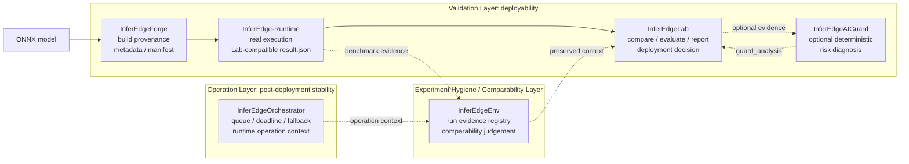

# InferEdge Ecosystem 1-Page Summary

Language: English | [한국어](ecosystem_1page.ko.md)

InferEdge is a local-first Edge AI lifecycle portfolio. It separates three
questions that are often mixed together in inference projects:

```text
Can we deploy this model?
Can this benchmark evidence be trusted and compared?
Can deployed workloads stay stable under load?
```

## Evidence Snapshot

| Signal | Evidence |
|---|---|
| Core validation path | Forge -> Runtime -> Lab (+ optional AIGuard) |
| Comparability layer | InferEdgeEnv local registry / comparability / runtime regression evidence |
| Operation layer | InferEdgeOrchestrator queue/deadline/fallback and worker-health evidence |
| TensorRT Jetson FP16 | 10.066 ms mean, 15.548 ms p99, 99.34 FPS |
| ONNX Runtime CPU baseline | 45.430 ms mean, 49.213 ms p99, 22.01 FPS |
| Jetson device-local replay | 96 frames, 155.86 ms mean, max 45.5 C / 1000 MB RAM |
| Jetson 5-minute-class replay | 3600 frames, Vision mean 152.77 ms, max 50.375 C / 1038 MB RAM |

## Ecosystem Diagram

Use this SVG as the submission-ready first visual for README, portfolio pages,
and slide decks:


Source asset:

```text
docs/assets/inferedge_ecosystem_diagram.svg
```

The Mermaid version below keeps the same structure editable in Markdown.



## Layer Roles

| Layer | Project | Question | Evidence |
|---|---|---|---|
| Validation | InferEdgeForge | How was this artifact built? | metadata, manifest, provenance |
| Validation | InferEdge-Runtime | How did it run on a real/device runtime boundary? | Lab-compatible `result.json`, latency/FPS/backend metadata |
| Validation | InferEdgeLab | Can we deploy this model? | compare output, evaluation report, Lab-owned deployment decision |
| Validation | InferEdgeAIGuard | Is there deterministic risk evidence? | `guard_analysis`, risk/diagnosis report |
| Comparability | InferEdgeEnv | Can this benchmark evidence be trusted and compared? | local artifacts, SQLite registry, export/import bundle, comparability report |
| Operation | InferEdgeOrchestrator | Can deployed workloads stay stable under load? | scheduler telemetry, overload comparison, drop/backlog/latency evidence |

## Canonical Ownership Matrix

This is the compact source-of-truth wording used across the entrypoint README
and the individual repository READMEs.

| Project | Owns | Does not own |
|---|---|---|
| InferEdgeForge | Build provenance / handoff evidence | Runtime execution, scheduling, deployment decision |
| InferEdge-Runtime | Execution, Lab-compatible result, runtime health and telemetry seed evidence | Build provenance, registry, anomaly detection, scheduling, deployment decision |
| InferEdgeLab | Validation report and Lab-owned deployment decision | Build execution, registry/comparability ownership, deterministic diagnosis ownership, scheduler behavior |
| InferEdgeAIGuard | Optional deterministic diagnosis and warning evidence | Final deployment decision, LLM root-cause inference, production monitoring |
| InferEdgeEnv | Local evidence registry, comparability judgement, runtime regression report | Production database, cloud telemetry store, deployment decision, general monitoring SaaS |
| InferEdgeOrchestrator | Runtime operation context, queue/deadline/fallback evidence, worker health evidence | Kubernetes replacement, cloud orchestration platform, deployability decision, completed production scheduler |

## Runtime Operation Starter Chain

The remote-dispatch and device-local paths are currently starter evidence
chains. They add operation context without replacing the Core validation
pipeline:

```text
InferEdgeOrchestrator
-> InferEdgeEnv
-> optional InferEdgeAIGuard
-> InferEdgeLab
```

- Orchestrator produces file-based worker-selection, starter execution status,
  bounded fallback, queue/deadline/fallback markers, and runtime event summary
  evidence.
- EdgeEnv preserves local registry / replay / handoff context when operation
  evidence is attached to a run.
- AIGuard turns the same observations into deterministic warning or review
  evidence.
- Lab owns the Runtime Intelligence / operation-risk report and final
  deployment decision.

This is not production remote execution, a cloud control plane, secure
multi-device orchestration, or a production observability platform.

## Submission Message

```text
InferEdge validates deployability.
InferEdgeEnv preserves benchmark evidence and judges comparability.
InferEdgeOrchestrator records operation context under overload.
```

The portfolio is not a benchmark leaderboard and not a production SaaS
dashboard. Its value is the separation of lifecycle responsibilities:
provenance, execution evidence, validation decision, comparability, and
post-deployment operation context.

## Reviewer Path

1. Start here for the ecosystem diagram and role split.
2. Read [Portfolio Summary](portfolio_summary.md)
   ([한국어: 포트폴리오 요약](portfolio_summary.md)) for the 30-second
   narrative.
3. Read [Pipeline Map](pipeline_map.md)
   ([한국어: 파이프라인 맵](pipeline_map.md)) for repository responsibilities.
4. Read [Interview Narrative](interview_narrative.md) for speaking notes.
5. Run the local submission smoke:

```bash
bash scripts/clone_all.sh --locked
bash scripts/smoke_all.sh
```

Then inspect the individual repository evidence:

- InferEdgeLab Local Studio and deployment decision evidence
- InferEdge-Runtime Jetson/runtime result evidence
- InferEdgeAIGuard deterministic diagnosis evidence
- InferEdgeEnv comparability evidence
- InferEdgeOrchestrator operation-control telemetry
